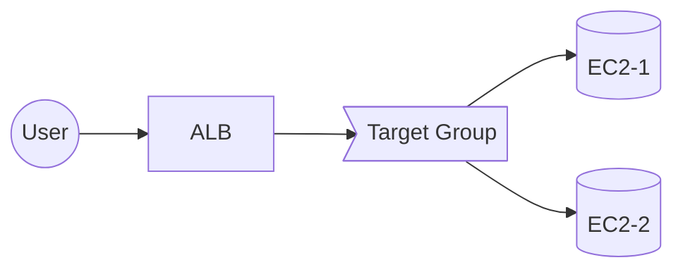

# タスク1: ALB + AutoScaling + EC2 で Web サーバ構築

## 概要

社内の簡易ステータスページを作成します。リクエストを受けた **ALB** が背後の **EC2 Auto Scaling** へルーティングし、各 **EC2 が自身のインスタンスIDを返す**ことで、トラフィック分散とスケール挙動を可視化します。

## 学習目標

- CDKを使用したALB、Target Group、Auto Scaling Groupの構築
- EC2インスタンスのユーザーデータでの初期化
- ヘルスチェックの設定と動作確認
- スケーリング挙動の理解

## 要件定義

### 基本要件

* VPC（2 つ以上の AZ）上に **ALB + Target Group + ASG(EC2)** を構築
* ALB の DNS 名にアクセスすると **EC2 のインスタンスID** を本文に返すこと
* ヘルスチェックが安定し、スケールアウト/インを確認できること（手動で DesiredCapacity を変更してOK）

### 技術要件

* Web サーバ種別（nginx/httpd/node など）は任意、AMI も任意（ユーザーデータで構成しても、カスタムAMIでもOK）
* パブリック ALB を推奨。EC2 はパブリックでもプライベートでも可（ALB から到達可能であること）
* 最小構成で可。TLS は任意（余裕があれば ACM を使って HTTPS 化）
* コスト最適のため **t3.micro** 相当で OK。終了後に削除

### 構成図（論理）



## 実装のヒント

### 必要なCDKリソース

1. **VPC関連**
   - VPC（2つ以上のAZ）
   - パブリックサブネット（ALB用、EC2用）
   - またはプライベートサブネット（EC2用）+ NAT Gateway（必要に応じて）
   - インターネットゲートウェイ（ALBをパブリックにする場合）

2. **ALB関連**
   - Application Load Balancer（パブリック）
   - ターゲットグループ（HTTP:80）
   - リスナー（HTTP:80）

3. **EC2関連**
   - Launch Template（インスタンスタイプ: t3.micro、ユーザーデータ）
   - Auto Scaling Group（Min: 1, Max: 3, Desired: 2）
   - セキュリティグループ（HTTP:80を許可）

4. **IAM**
   - EC2用のインスタンスプロファイル（必要に応じて）

### 参考ユーザーデータ（Amazon Linux 2023 / nginx の例）

```bash
#!/bin/bash
set -eux
INSTANCE_ID=$(curl -s http://169.254.169.254/latest/meta-data/instance-id)
# nginx
dnf -y install nginx
cat >/usr/share/nginx/html/index.html <<EOF
<html><body><h1>${INSTANCE_ID}</h1></body></html>
EOF
systemctl enable nginx
systemctl start nginx
```

### スタック設計の提案

以下のようなスタック分割を推奨します：

- `NetworkStack`: VPC、サブネット、IGW、ルートテーブル
- `AlbAsgStack`: ALB、Target Group、Launch Template、Auto Scaling Group

## 検証手順

### 1. ALB DNS名の確認

CDKデプロイ後に出力されたALBのDNS名を確認してください。

### 2. ラウンドロビンの確認

1. ALB の DNS 名に数回アクセス（ブラウザまたは `curl`）
2. **インスタンスIDが切り替わる**ことを確認（ラウンドロビン）

```bash
# 例
curl http://<alb-dns-name>.elb.amazonaws.com
# 複数回実行して異なるインスタンスIDが返ることを確認
```

### 3. スケーリング挙動の確認

1. Auto Scaling Groupのコンソールで Des interferenceCapacity を確認
2. DesiredCapacity を 1→2→1 に変更
3. 増減時も疎通・ヘルスチェックが安定することを確認
   - 新規インスタンス起動後、ヘルスチェックが通るまで待つ
   - ALBへのアクセスが継続できることを確認

### 4. ヘルスチェックの確認

- Target Groupのヘルスチェックステータスを確認
- 全てのターゲットが `healthy` になることを確認

## 成功条件

- [ ] ALB の DNS 名にアクセスできる
- [ ] インスタンスIDが返される
- [ ] 複数回アクセスでインスタンスIDが切り替わる（ラウンドロビン）
- [ ] ASG の DesiredCapacity を変更しても正常動作する
- [ ] ヘルスチェックが安定している

## トラブルシューティング

### ALBに接続できない

- セキュリティグループでHTTP(80)が開いているか確認
- ALBがパブリックサブネットに配置されているか確認
- ターゲットグループのヘルスチェック設定を確認

### EC2インスタンスがUnhealthy

- セキュリティグループでALBからEC2へのアクセスが許可されているか確認
- nginx等のWebサーバが正常に起動しているか確認（EC2にSSH接続して確認）
- ユーザーデータが正しく実行されているか確認（/var/log/cloud-init-output.log）

### インスタンスIDが表示されない

- ユーザーデータ内でメタデータ取得が正しく動作しているか確認
- HTML生成が正しく行われているか確認

## クリーンアップ

ハンズオン終了後、作成したスタックを削除してください：

```bash
cdk destroy --all
```

**重要**: 費用が発生するため、必ず削除してください。

## 追加課題（任意・発展）

* **ECS (Fargate)** へ置き換え（ターゲットタイプ ip）。同様にコンテナからインスタンスID相当（TaskARN など）を返す
* **マルチリージョン + Route 53** のヘルスチェックとフェイルオーバー。東京/大阪など 2 リージョンに同構成を立て、ヘルスダウン時に自動切替
* **HTTPS化**: ACMを使用してHTTPSリスナーを追加

