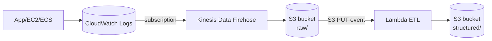

# タスク2: CloudWatch Logs → Firehose(5分バッファ) → S3 → Lambda 事前処理

## 概要

EC2/ECS 上のアプリから **CloudWatch Logs** に継続出力される **アクセスログ（Common Log Format 互換）** を、**Kinesis Data Firehose** で **5分毎にバルク出力**して **S3** に蓄積。到着トリガーで **Lambda** がログを**パース・正規化・日次集計キー付与**までを行い、**後続の分析基盤（例: Athena/Glue、外部DWH など）**が取り込みやすい JSON に整形します。

## 要件定義

### 基本要件

* CloudWatch Logs グループ→ Subscription で **Firehose** へ配信
* Firehose は **5分 or 5MB** をバッファ条件に **GZIP 圧縮**で **S3** へ配信（失敗時のバッファバケットも設定）
* S3 の `raw/` プレフィックスに日付パーティションで到着（例: `s3://<bucket>/raw/2025/10/10/…`）
* S3 **PUT イベント** で **Lambda** を起動し、GZIP を解凍→行毎にパース→**正規化 JSON** を `structured/` に書き戻し
* Lambda は `lambda/etl-processor.py`を使用してください。

### ログ例（CLF 互換）

```
192.0.2.1 - - [10/Oct/2025:13:55:36 +0000] "GET /api/items?id=1 HTTP/1.1" 200 123 "-" "curl/8.1"
198.51.100.2 - - [10/Oct/2025:13:55:37 +0000] "POST /api/order HTTP/1.1" 500 45 "-" "python-requests/2.32"
```

### 構成図



## 事前準備

### 1. CloudWatch Logsへのログ出力環境のセットアップ

本ハンズオンでは、EventBridge + Lambdaを使用してCloudWatch Logsにログを出力する環境をあらかじめ用意します。

`setup-log-generator.yaml` を使用してCloudFormationテンプレートをデプロイしてください。詳しい手順は [CloudFormationデプロイ手順](#cloudformationデプロイ手順) を参照してください。

この環境により、以下のリソースが作成されます：
- CloudWatch Logs グループ: `/aws/access-logs/app-access-logs`（アクセスログ用）
- CloudWatch Logs ストリーム: `app-instance-001`（固定のインスタンスID形式）
- EventBridge ルール: 5分ごとにLambda関数を実行
- Lambda関数: CLF形式のログを指定されたCloudWatch Logsグループに直接出力

### 2. 必要なファイル

- `setup-log-generator.yaml`: CloudFormationテンプレート（ログ生成環境）
- `lambda/etl-processor.py`: ETL処理用Lambda関数

## 実装のヒント

### 必要なCDKリソース

1. **S3関連**
   - S3バケット（ログ保存用）
   - バケットポリシー（Firehoseの書き込み権限）
   - イベント通知設定（Lambdaトリガー）

2. **Kinesis Data Firehose**
   - Delivery Stream（5分/5MBバッファ、GZIP圧縮）
   - S3バケットへの配信設定
   - 日付パーティション設定（`raw/!{timestamp:yyyy/MM/dd}/`）
   - エラー出力バケット（失敗時のバッファ）

3. **CloudWatch Logs Subscription Filter**
   - LogsグループへのSubscription Filter設定
   - Firehoseへの配信設定

4. **Lambda関数**
   - ETL処理用Lambda関数
   - S3イベントトリガー設定
   - IAMロール（S3読み書き、CloudWatch Logs出力）

5. **IAMロールとポリシー**
   - Firehose用ロール（S3書き込み、CloudWatch Logs読み取り）
   - Lambda用ロール（S3読み書き、CloudWatch Logs書き込み）

### スタック設計の提案

以下のようなスタック分割を推奨します：

- `LogIngestStack`: CloudWatch Logs Subscription Filter、Firehose、S3バケット
- `EtlLambdaStack`: Lambda関数、S3イベント通知、IAMロール

### Lambda関数の実装

ETL処理用Lambda関数（`lambda/etl-processor.py`）を参照してください。この関数は：
- S3からGZIPファイルを取得・解凍
- 各行をCLF形式としてパース
- 正規化JSONを生成（成功したログは `structured/` に、失敗したログは `structured/failed/` に出力）
- 処理の成功/失敗をCloudWatch Logsに出力

## 検証手順

### 1. ログ生成の確認

1. CloudFormationでデプロイしたログ生成環境が動作していることを確認
2. CloudWatch Logsグループ `/aws/access-logs/app-access-logs` にログが出力されていることを確認

```bash
# CloudWatch Logsを確認（アクセスログ）
aws logs tail /aws/access-logs/app-access-logs --follow

# ログストリームを確認
aws logs describe-log-streams \
  --log-group-name /aws/access-logs/app-access-logs \
  --log-stream-name-prefix app-instance-001
```

### 2. Firehose → S3への配信確認

1. 5分待機（またはFirehoseのバッファ条件を満たすまで）
2. S3バケットの `raw/` プレフィックスにGZIPファイルが作成されることを確認

```bash
aws s3 ls s3://<bucket-name>/raw/ --recursive
```

### 3. Lambda実行とJSON出力の確認

1. S3にファイルが作成されると、自動的にLambdaが実行される
2. S3バケットの `structured/` プレフィックスにJSONファイルが作成されることを確認

```bash
# 正規化されたログの確認
aws s3 ls s3://<bucket-name>/structured/ --recursive

# JSONファイルの内容を確認
aws s3 cp s3://<bucket-name>/structured/<file>.json -
```

### 4. CloudWatch LogsでのLambda実行ログ確認

1. Lambda関数のCloudWatch Logsグループを確認
2. 処理の成功/失敗ログが出力されていることを確認

```bash
aws logs tail /aws/lambda/<lambda-function-name> --follow
```

## 成功条件

- [ ] CloudWatch Logsにログが出力されている
- [ ] FirehoseがログをS3に配信している（`raw/` にGZIPファイルが作成される）
- [ ] LambdaがS3イベントで実行される
- [ ] `structured/` にパース済みJSONが生成される
- [ ] Lambdaの実行ログで成功/失敗が確認できる

## 制限・注意

* Firehose のデリバリー先は **同一リージョンの S3**。圧縮は GZIP を推奨
* サンプルでは 5分/5MB のいずれかでフラッシュ。ワークロードにより調整可
* Lambda タイムアウトは 3 分以上推奨（データ量により調整）
* コスト最適化のため、ハンズオン終了後は消費量を確認してから削除

## トラブルシューティング

### FirehoseがS3に書き込まない

- FirehoseのIAMロールにS3書き込み権限があるか確認
- S3バケットポリシーでFirehoseからの書き込みが許可されているか確認
- Firehoseのバッファ条件（5分/5MB）を満たしているか確認

### Lambdaが実行されない

- S3イベント通知が正しく設定されているか確認
- Lambda関数のIAMロールにS3読み取り権限があるか確認
- CloudWatch LogsでLambda関数の実行エラーを確認

### パースエラーが多い

- ログ形式がCLF互換であることを確認
- `structured/failed/` に出力されたログを確認
- 正規表現のパターンを調整（必要に応じて）

## クリーンアップ

ハンズオン終了後、以下の順序で削除してください：

1. CDKスタックの削除
   ```bash
   cdk destroy --all
   ```

2. CloudFormationスタックの削除（ログ生成環境）
   ```bash
   # スタックの削除
   aws cloudformation delete-stack \
     --stack-name hands-on-log-generator \
     --region ap-northeast-1

   # 削除状態の確認（オプション）
   aws cloudformation describe-stacks \
     --stack-name hands-on-log-generator \
     --region ap-northeast-1
   ```

   Windows PowerShellの場合:
   ```powershell
   aws cloudformation delete-stack `
     --stack-name hands-on-log-generator `
     --region ap-northeast-1
   ```

   Windows CMDの場合:
   ```cmd
   aws cloudformation delete-stack ^
     --stack-name hands-on-log-generator ^
     --region ap-northeast-1
   ```

**重要**: S3バケットにデータが残っている場合は手動で削除してください。費用が発生するため、必ず削除してください。

## CloudFormationデプロイ手順

詳細は [CloudFormationデプロイ手順](./DEPLOY_LOG_GENERATOR.md) を参照してください。

