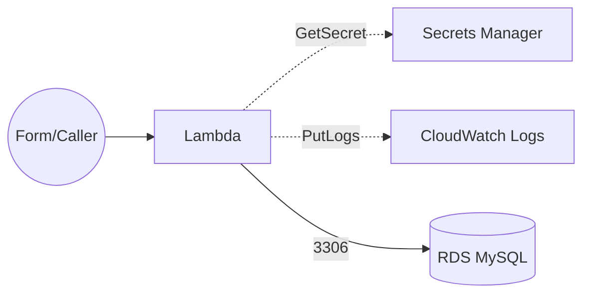

# タスク3: VPC 内 Lambda から Secrets Manager 経由で RDS に登録

## 概要

お問い合わせフォーム（フロントは省略）の送信情報を **Lambda** が受け取り、**Secrets Manager** に保管された DB 資格情報を用いて **RDS（MySQL/Aurora MySQL）** に **プライベート接続で INSERT** します。RDS, Lambdaともに **プライベートサブネット**に配置し、インターネット非到達の状態とします。

## 要件定義

### 基本要件

* VPC（2 つ以上の AZ）。**プライベートサブネットで RDS および Lambda** を作成
* IGWについては設置しても問題ないですがNGWについては作成しないでください。
* Lambda は `lambda/rds-insert-handler.py`を使用してください
* **Secrets Manager** に `db-credentials` シークレットを作成（JSON）
* セキュリティグループ: Lambda → RDS の 3306/TCP を許可。最小権限

### 構成図



## 事前準備

### 1. データベーステーブルの作成

RDSインスタンス作成後、データベースに接続してテーブルを作成する必要があります。

詳細な手順は [テーブル作成手順](./DATABASE_SETUP.md) を参照してください。

### 2. Secrets Managerへのシークレット登録

RDSインスタンス作成後、以下の形式でシークレットを登録してください：

```json
{
  "engine": "mysql",
  "host": "<rds-endpoint>",
  "port": 3306,
  "username": "appuser",
  "password": "<your-password>",
  "dbname": "appdb"
}
```

**重要**: シークレット名は `db-credentials` としてください（またはLambda関数の環境変数で指定）。

### 3. 必要なファイル

- `lambda/rds-insert-handler.py`: RDSにINSERTするLambda関数
- `DATABASE_SETUP.md`: テーブル作成手順
- `LAMBDA_TEST.md`: Lambda関数のテスト手順

## 実装のヒント

### 必要なCDKリソース

1. **VPC関連**
   - VPC（2つ以上のAZ）
   - **プライベートサブネット**（Lambda用、RDS用）
   - セキュリティグループ（Lambda用、RDS用）
   - +α

2. **RDS関連**
   - RDS MySQL/Aurora MySQLインスタンス（プライベートサブネット、マルチAZ推奨）
   - データベース名、ユーザー名、パスワード
   - パラメータグループ（必要に応じて）

3. **Secrets Manager**
   - シークレット: `db-credentials`（JSON形式）

4. **Lambda関数**
   - VPC内で実行するLambda関数
   - プライベートサブネットに配置
   - IAMロール（Secrets Manager読み取り、CloudWatch Logs書き込み）
   - 環境変数: `SECRET_ID=db-credentials`

### Lambda関数の実装

RDS INSERT用Lambda関数（`lambda/rds-insert-handler.py`）を参照してください。この関数は：
- Secrets Managerからデータベース認証情報を取得
- PyMySQLを使用してRDSに接続
- リクエストデータを `inquiries` テーブルにINSERT
- 処理の成功/失敗をCloudWatch Logsに出力

### 依存パッケージの管理

Lambda関数でPyMySQLを使用するため、以下のいずれかの方法で依存パッケージを追加する必要があります：

1. **Lambdaレイヤーを使用**（推奨）
2. **デプロイパッケージに同梱**（レイヤーを使用しない場合）

インターネット非到達環境のため、**Lambdaレイヤーやデプロイパッケージは事前に準備**してください。

## 検証手順

### 1. テーブル作成の確認

RDSに接続して `inquiries` テーブルが作成されていることを確認してください。

### 2. Secrets Managerの確認

AWSコンソールまたはCLIでシークレットが正しく作成されていることを確認：

```bash
aws secretsmanager describe-secret --secret-id db-credentials --region ap-northeast-1
```

### 3. VPCエンドポイントの確認

VPCエンドポイントが正しく作成され、利用可能な状態であることを確認：

```bash
aws ec2 describe-vpc-endpoints --region ap-northeast-1
```

### 4. Lambda関数のテスト

詳細なテスト手順は [Lambda関数テスト手順](./LAMBDA_TEST.md) を参照してください。

基本的な流れ：
1. Lambda関数のコンソールでテストイベントを作成
2. テストイベントを実行
3. CloudWatch Logsで実行結果を確認
4. RDSでレコードが挿入されたことを確認

## 成功条件

- [ ] RDS に `inquiries` テーブルが作成済みであること
- [ ] Secrets Managerに `db-credentials` シークレットが作成されていること
- [ ] テストイベント実行で Lambda が成功（200）すること
- [ ] RDS にレコードが追加されること
- [ ] Lambda 実行は **NAT/IGW 無し**でも成功すること

## 制限・注意

* RDS は **シングルAZ** で問題ないです。

## トラブルシューティング

### Lambda関数がタイムアウトする

- セキュリティグループで適切な通信が許可されているか確認
- RDSエンドポイント名が正しいか確認
- CloudWatch Logsでエラー内容を確認

### RDSに接続できない

- セキュリティグループでLambdaからRDS（3306/TCP）への通信が許可されているか確認
- RDSエンドポイント名とポート番号が正しいか確認
- Secrets Managerのシークレット内容（host、port、username、password、dbname）が正しいか確認
- データベースが正しく作成されているか確認

### CloudWatch Logsに出力されない

- VPCエンドポイントのセキュリティグループでLambdaからの通信が許可されているか確認
- Lambda関数のIAMロールに `logs:CreateLogGroup`、`logs:CreateLogStream`、`logs:PutLogEvents` 権限があるか確認

## クリーンアップ

ハンズオン終了後、作成したスタックを削除してください：

```bash
cdk destroy --all
```

**重要**: 以下のリソースも手動で削除する必要がある場合があります：
- Secrets Managerのシークレット
- RDSスナップショット（自動スナップショットが作成されている場合）

費用が発生するため、必ず削除してください。

## 参考資料

- [テーブル作成手順](./DATABASE_SETUP.md)
- [Lambda関数テスト手順](./LAMBDA_TEST.md)

